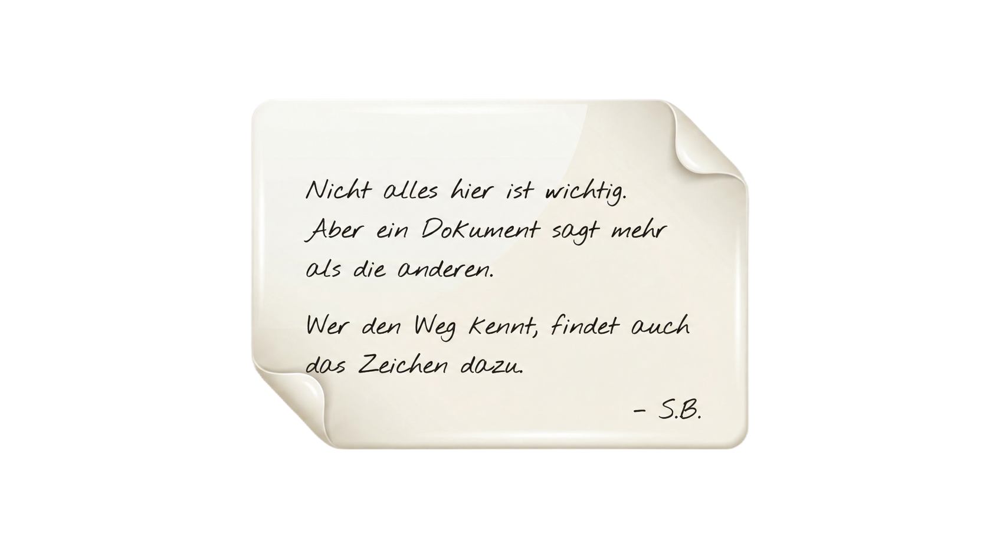

# CTF Room: "Was M.L. wusste"

---

  

  
  
  
  
  

---

## Hintergrundgeschichte

Northwind Outdoor Supply ist ein mittelständischer Händler für Wander- und
Outdoor-Ausrüstung mit mehreren Lagerstandorten und einem wachsenden
Online-Geschäft. Vor drei Wochen hat die Finanzbuchhaltung eine externe
Prüfung angestoßen, nachdem über mehrere Abrechnungszeiträume hinweg Zahlen
im Lieferantengeschäft nicht mehr zusammenpassten.

Kurz bevor sie das Unternehmen verließ, hat eine Mitarbeiterin aus dem
Controlling – intern nur als "M.L." bekannt – einen vollständigen Export der
Betriebsdatenbank angefertigt: Kunden, Bestellungen, Lagerbestände,
Mitarbeiterlisten, Lieferantenlisten, Support-Tickets, Prüfprotokolle und
Berichte. Offiziell als Backup deklariert, tauchte der Export wenig später
anonym in einem internen Postfach der IT-Sicherheitsabteilung wieder auf –
zusammen mit einer kurzen Notiz:

   
   
  
   
   

Seitdem liegt der komplette Datenexport unangetastet auf einem
Analyse-Rechner der Security-Abteilung – inklusive der Original-Notiz.

## Deine Rolle

Du bist frisch in die interne IT-Forensik von Northwind gewechselt und
bekommst diesen Datenexport als deinen ersten Fall auf den Tisch. Niemand
weiß genau, was M.L. eigentlich beweisen wollte – nur, dass sie offenbar
gezielt Spuren hinterlassen hat, bevor sie ging.

## Deine Aufgabe

Sichte die Dateien im Datenexport und finde das versteckte Beweisstück
(die **Flag**). Nicht jede Datei im Export ist relevant – M.L. war
offensichtlich vorsichtig und hat ihre Spur bewusst zwischen viel
Alltagsdaten versteckt, um sie vor neugierigen Blicken zu schützen, die den
Export vor dir schon durchsucht haben könnten.

**Hinweis:** M.L. war niemand, der sich auf reinen Zufall verlassen hat. Wenn
sie sagt, es gibt "ein Zeichen", das den "Weg" zeigt – dann lohnt es sich,
genau hinzuschauen, welche Datei im Export selbst gar nicht wie die anderen
aussieht.

## Flag-Format

`flag{...}` · [Flag prüfen](https://bobbobinson007.github.io/ctf/check.html)

## Regeln

- Keine Brute-Force-Angriffe auf die Verschlüsselung nötig – alles Benötigte
  befindet sich im Datenexport selbst.
- Standard-Tools zur Bildanalyse, Dateiuntersuchung und Entschlüsselung
  reichen vollkommen aus.
- Viel Erfolg, Analyst:in.
